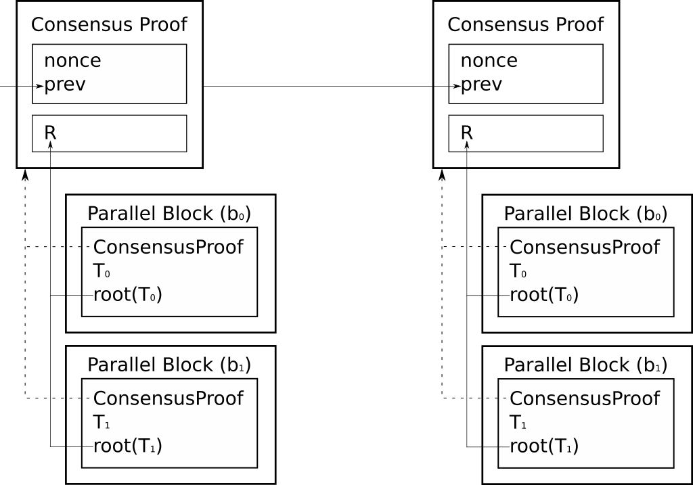

# Parallel Proof-of-Work: A cumulative security system for proof-of-work blockchains

**Abstract**  
Exogenous mining power presents an ongoing threat to the security of independent blockchains. Two or more independent blockchains implementing a single proof-of-work algorithm will result in only one strongly secure blockchain because no economic incentive prevents mining nodes on the strongest blockchain from attacking a weaker one. Parallel proof-of-work combines the cumulative work done in all participating networks, removing wasted competition, and bringing all networks to consensus by adding up their work.  

## Introduction
Include deeper discussion on the current state of PoW security

We propose a proof-of-work system separating a block into two distinct logical categories.  First, a header containing proof-of-work and a transaction tree, called the _consensus proof_. Second, a set of blocks called _parallel blocks_, each one containing the set of transactions from a corresponding participating blockchain.  Nodes compete to find proof-of-work to secure all parallel blocks.

## Background
Merge mining/auxiliary proof of work namecoin  
51% attack costs https://www.crypto51.app/   
Sharding paradigms/IBC

## Definitions
**b** is a _parallel blockchain_, a blockchain participating in the parallel proof-of-work system.  
**B** is the set of all parallel blockchains such that **B = (b0, b1, …, bn)**.  
**hash(P)** is the hash digest of preimage data **P**.  
**nonce** is the field of data used to satisfy the difficulty requirement for a consensus proof.  
**prev** is the hash of the previous consensus proof.  
**Tb** is a set of transactions waiting to be mined in a parallel blockchain **b**.  
**root(T)** is the merkle root of all transactions within the set of transactions **T**.  
**R** is a merkle root containing all **T** within **B** such that **R = root(root(T0), root(T1), … root(Tn))**.  

## Example
Consider a system with two parallel blockchains, **b0** and **b1**.

**ConsensusProof = hash(nonce, prev, R)**  
**ParallelBlock(b0) = hash(ConsensusProof, T0, root(T0))**  
**ParallelBlock(b1) = hash(ConsensusProof, T1, root(T1))**  

The steps to construct the blockchain are mostly the same as classic proof-of-work:

1. New transactions from blockchain **b0** are broadcast to all other **b0**-aware nodes. 
2. Nodes attempting to find proof-of-work collect all transactions from all blockchains. 
3. When a node finds proof-of-work for a consensus proof, it can issue parallel blocks for each blockchain it has collected transactions for, earning rewards from each.

## Result
The result is collaboration between multiple blockchains using the same mining algorithm.  Mining nodes that find a valid consensus proof are able to construct parallel blocks for each participating blockchain in the network, generating coins in each blockchain. 

## Discussion

#### What happens to miners on each separate chain?
Miners are now mining for a single nonce that validates the blocks of all parallel chains.

#### Who gets rewarded for mining now?
Miners get to reward themselves a coinbase for _every parallel blockchain_ in the system if they find valid proof-of-work.

#### What does "exogeneous mining power is a threat" mean?
Exogeneous mining power is a threat means when DOGE hashrate falls, the LTC hashrate is a threat to the DOGE security model, because LTC miners have no incentive to not attack the DOGE chain. (DOGE and LTC both have ~200TH right now, but if DOGE falls lower, they are vulnerable to attack).

#### Don't network protocols need to be compatible for this to work?
Network protocols definitely need to be compatible, practically speaking, this would be merging a few coins' networks together.

#### How does transaction verification work?
We're using the same method of checking transactions as bitcoin, litecoin, etc.

#### Do all nodes need to have the same difficulty and blocktime rules?
Yes. Fundamentally this isn't an issue because blocktime isn't significant, cumulative work over time is what is really significant.

#### Doesn't this make the the chain as strong as the weakest link?
No. Actually, this solution came about to solve that exact issue. When all miners are mining to find the same nonce, and all blockchains are using that nonce to consider their blocks valid, there is no weakest or strongest chain. They are all secured by the same hashrate.

## References
